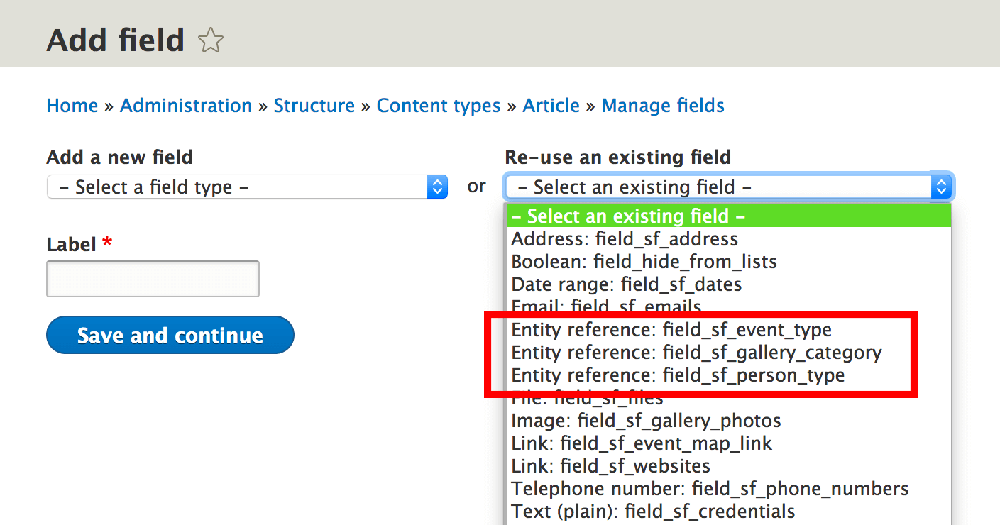
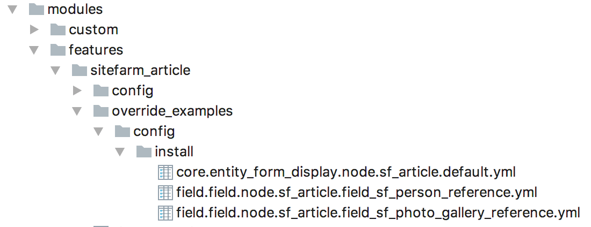
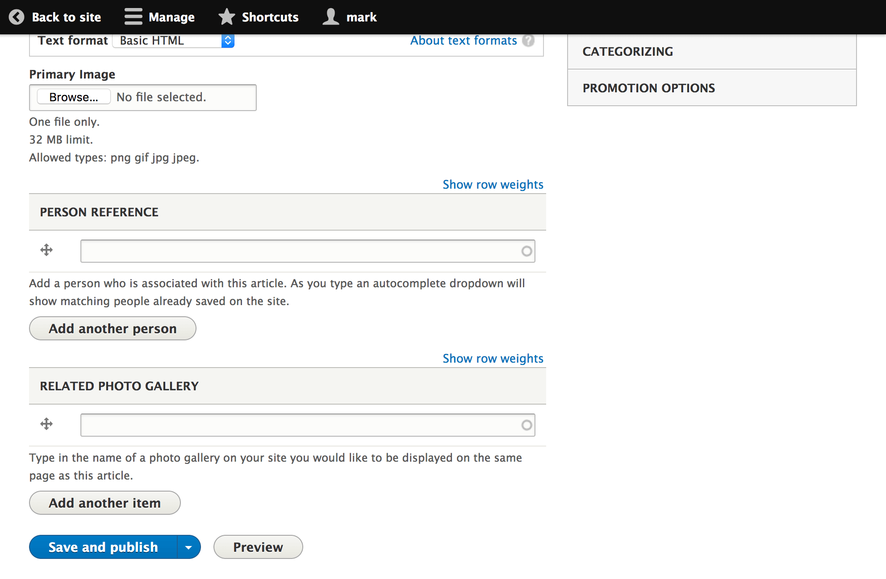

# Adding a default core reference field onto an existing content type

Sitefarm Seed already provides base fields for Entity References to core content
types. This means that by reusing these existing fields all that is needed is
config for field instances.

## Example: Adding a Reference field to Photo Galleries or Persons

*As a Developer, I want to add an entity reference field on the Article content
type to the Photo Gallery and Person content types so that I can offer blocks
rendering related content.*

This will require first to make dependencies on the `sitefarm_photo_gallery`
and `sitefarm_person` content types. This means requiring these modules before
the `sitefarm_article` module in the subprofile's `.info` file.

Second, add config files for field instances and node form display. 

**examples:** `modules/features/sitefarm_article/override_examples/add_reference_fields/`

The `core.entity_form_display.node.sf_article.default.yml` adds both of the
new field instances to the edit form so that an editor can add references to the
appropriate content.

Based on the example config, the fields will not be displayed on the node's
display. This is intended so that the content can be displayed in blocks.

Creating an article `/node/add/sf_article` will now show the new fields.

