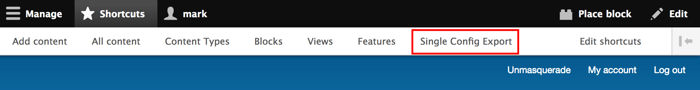

# Adding New Configuration in a Sub Profile

## General

Extending Sitefarm Seed with new configuration in a sub profile is a matter of
exporting new yaml files and placing them in the `/config/install` directory.
These config files can also go into a module's `/config/install` directory in
the sub profile.

### Individual File Export

Sometimes it is more efficient to export a single file of configuration rather
than a bundle in a Feature.

To export a single yaml file of configuration, go to the Single Config Export
page. User 1 has a shortcut to this page in their toolbar.
 


Choose the configuration type and name. Then copy the configuration and paste it
into a new yaml file named based on the "Filename" given at the bottom of the
page (under the textarea where the config can be copied).

> **Important!** Remember to strip out any UUID or defualt_config_hash information

```yaml
uuid: e1083155-1afb-4d23-acff-17729aec7bc3
_core:
  default_config_hash: p_AtPbTd6niywC8P6zRfczYFjPDsejfH7Qcwo47ixCM
```

### Features Module

Using the Features Module to bundle and export a group of configuration is best
for entirely new items like Content Types that will also have path aliases, new
image styles, multiple display modes, and associated views.

Documentation for using the Features module in Drupal 8 can be found here:
[https://www.drupal.org/docs/8/modules/features](https://www.drupal.org/docs/8/modules/features)

> **Tip:** The Features UI module is not enabled by default in Sitefarm Seed. So
it will need to be turned on first.

## New Content Type

A new content type will contain many different configuration files. It is often
best to use the Features module to export all of the configuration at once. Even
if a new features module is not desired, the config files can be copied to the
desired destination.

In its simplest, the definition of a content type is in a single file: 
`node.type.machine_name.yml`.

Accompanying this file will be form displays
`core.entity_form_display.node.machine_name.default.yml` and display modes
`core.entity_view_display.node.machine_name.default.yml`. The last paramater of
those config files `defualt` will be changed based on the view mode machine
name. So a "Teaser" view mode would be
`core.entity_view_display.node.machine_name.teaser.yml`.

Finally, any fields that are attached to the content type will have config
files. Every field will have an instance file
`field.field.node.machine_name.field_machine_name.yml`. Brand new fields will
also have an accompanying storage file `field.storage.node.field_machine_name.yml`.

## New Field on existing content type

### Field Storage
Brand new fields (that are not being reused from existing fields) will have a
storage file `field.storage.node.field_machine_name.yml`. Without this the new field
will fail to work. This file stores the general configuration for this field.

### Field Instance
Every field (including reused fields) will require a field instance file
`field.field.node.content_type_machine_name.field_machine_name.yml`. This file
stores the specific configuration for this individual instance on a node.

> **Tip!** SiteFarm Seed provides some reference fields already that can be
use. See docs for [Adding a default core reference field onto an existing content type](adding-core-reference-field.md)

### Form and Display Mode placement
Simply adding a field does not mean that it will appear on a node edit form or
its display. Each content type controls placement and display for all fields.
The files which control this start with `core.entity_form_display` and
`core.entity_view_display`.

## New View
Each View is stored in its own configuration file in the format of
`views.view.machine_name.yml`. Export this individual file and place it into a
custom module's `config/install` directory.

## New Block instance
By default SiteFarm Seed does not provide any block instances. This is because
block instances are tied to a specific theme. In your sub profile you will
likely have a default theme so it makes sense to provide default block instances
such as main navigation and footer.

Block instance config files are formatted as `block.block.machine_name.yml`.
Block instances are best placed into a custom module's `/config/optional`
directory. You will notice this is different than the "install" directory. The
"optional" directory is used due to blocks often having many of their own
dependencies. See [https://www.drupal.org/node/2453919](https://www.drupal.org/node/2453919)
for more information on the "optional" directory.

## Advanced additions with Config Actions

[Config Actions](https://www.drupal.org/project/config_actions) is a module that
can be included in a sub profile which provides much more fine-grained control
over adding new configuration. This is an option if simply adding new config
files or feature modules isn't quite enough.

Documentation can be found here: [http://config-actions.readthedocs.io/en/latest/index.html](http://config-actions.readthedocs.io/en/latest/index.html)
