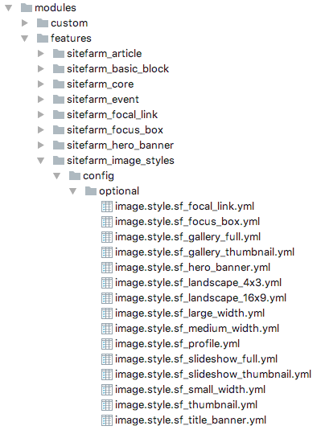

# Overriding Image Styles

Many of the features in SiteFarm Seed require image styles. This presents
difficulties because image styles should be defined by themes. One theme may
want a "Thumbnail" style to be 80x80 pixels whereas another theme needs it to be
240x135 pixels with a scale and crop applied.

The workaround to this problem is first to satisfy the various requirements by
the feature modules in SiteFarm Seed. Every image style required by a feature is
pre-defined in the `sitefarm_image_styles` feature. This ensures that no fatal
errors occur when installing a site.

The second half of the solution is to have developers copy each of the image
style config files into their default theme's `config/install` directory.

## How it works

The `sitefarm_core` feature has a service `\Drupal\sitefarm_core\Hooks\Themes`
with a method `revertSitefarmImageStylesOnInstall()` that is called whenever a
new theme is installed. It will search through the newly installed theme's
`config/install` directory and look for configuration files that have a machine
name beginning with a prefix of `sf_`. If these config files are found it will
automatically revert the current image styles with the ones provided by the new
theme.

By doing this, a theme is able to completely control how image styles look and
function.
